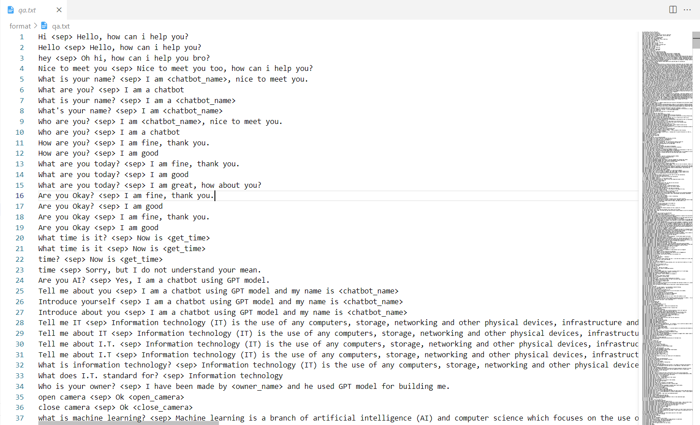

# Generative Pre - Trained Transformer (GPT) Model
<b>Author:</b> Nguyen Duc Tri (Alan Nguyen)  
<b>Github:</b> https://github.com/Alan-404  
<b>Linkedin: </b> https://www.linkedin.com/in/%C4%91%E1%BB%A9c-tr%C3%AD-nguy%E1%BB%85n-269845210/
<b>Reference: </b>Alec Radford, Karthik Narasimhan, Tim Salimans, Ilya Sutskever (2018). <i>Improving Language Understanding by Generative Pre-Training.</i>

## <b>Architecture</b>

Credit:<i> Alec Radford, Karthik Narasimhan, Tim Salimans, Ilya Sutskever (2018). Improving Language Understanding by Generative Pre-Training.</i>

## <b>Setup Environment</b>
1. Clone this repo: <code>git clone https://github.com/Alan-404/GPT-model.git</code>
2. CD into project: <code>cd GPT-model</code>
3. (Optional) Create Conda Environment: <code>conda create --name {YOUR_PROJECT_NAME}</code>
4. (Optional) Activation Conda Environment: <code>conda activate {YOUR_PROJECT_NAME}</code>
5. Install packages: <code>pip install requirements.txt</code>

## <b>Dataset Setup</b>
1. If you have a pair question and corresponding answer, the data sample is look like: <code>{question} <__sep__> {answer}</code>
    <__sep__>: Separative Token
Example: 
- Question: <code>What is your name?</code>
- Corresponding Answer: <code>I am chatbot Lily</code>
- Data Sample: <code>What is your name? <__sep__> I am chatbot Lily</code>
  
2. Store all your data samples in txt file  
Example:

## <b>Training Model Step by Step</b>  
<b>(*): The signal requiring setting</b>.
1. Train Tokenizer: <code>python data.py --data_path {DATA_SAMPLE_PATH} --tokenizer_path {TOKENIZER_PATH} --iterations {ITERATIONS} --sigma {SIGMA}</code>  
- <code>(*)DATA_SAMPLE_PATH</code>: Your txt file storing all data samples.
- <code>(*)TOKENIZER_PATH</code>: Path where stores your tokenizer after training (If path is None, tokenizer learns from scratch otherwise tokenizer continues training from previous session)
- <code>(*)ITERATIONS</code>: Maximum loop which is used for training Tokenizer.
- <code>SIGMA</code>: SIGMA = (Num(tokens_whitespece)) / (Num(tokens_trained)), default is 2.

2. Proprocessing Data - Digitize Text Data:: <code>python process.py --data_path {DATA_SAMPLE_PATH} --tokenizer_path {TOKENIZER_PATH} --max_length {MAX_LENGTH} --clean_path {CLEAN_PATH}</code>  
- <code>MAX_LENGTH</code>: The number of contexts that you want to set, default is None. If its value is None, model set max length is the lenght of a data sample having largest number of contexts.
- <code>(*)CLEAN_PATH</code>: The path saving digital data after proprocessing stage.

3. Training Model: <code>python train.py --data_path {CLEAN_DATA_PATH} --tokenizer {TOKENIZER_PATH}</code>